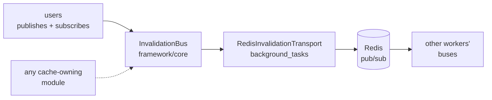

# Cache invalidation

`InvalidationBus` tells the *other* worker processes that something they have cached stopped being true. It is in-process by default and cross-process when a transport is installed.

It is not `EventBus` and not a queue. `EventBus` carries domain events inside one process and its handlers may do anything; this carries "forget an entry" and its handlers may only forget. Neither persists, retries, or guarantees delivery — so **every consumer keeps a TTL as its floor** and treats the bus as an accelerator over it. Work that must happen exactly once belongs in a Celery task.

## The problem it solves

Several modules cache a row that is cheap to read and expensive to read *often*:

| Cache | Read on | Owner |
|---|---|---|
| `User.session_version` | nearly every authenticated request | `users.session_version_cache` |
| aggregate storage size | the files index | `file_storage` |
| hydrated settings objects | every request that reads a setting | `settings` |

All three shared one failure shape: the worker that performed the write dropped its own entry immediately and **every other worker kept serving the stale value until its own entry expired**. Acceptable for "sign out everywhere"; much less so for a password change made because an account is believed compromised ([#318](https://github.com/antosubash/simple_module_python/issues/318)).

The obvious fix — publish on Redis pub/sub — was not reachable from any of those modules. Redis belongs to the `background_tasks` plugin, so `users` would have to open a second connection with its own settings that can disagree with it; `SM009` makes a `framework/*` → plugin import an error, so the framework cannot borrow the plugin's client either. Hence the split below.

## Who owns what



The framework owns the bus: the channel registry, the wire format, and the filter that stops a worker acting on its own broadcast coming back. It knows nothing about how a message travels. Whoever owns a shared backend installs a transport on it — `background_tasks` does, with the Redis connection it already configures for Celery.

With no transport installed the bus is honest in-process pub/sub, which is the behaviour that predates it.

## Subscribing

Override `register_invalidations`. Handlers may be sync or async, and may only forget:

```python
_TOTALS: TTLCache = TTLCache(maxsize=1000, ttl=60)


class OrdersModule(ModuleBase):
    def register_invalidations(self, bus: InvalidationBus, app: FastAPI) -> None:
        bus.subscribe("orders.totals", lambda inv: _TOTALS.pop(inv.key, None))
```

Channel naming is `<module>.<cache>`. `Invalidation.key` is `None` for "forget the whole channel".

**The key is a string on the wire.** If your cache is keyed by anything else — `users` keys by `uuid.UUID` — convert on the way in, or the handler pops a key that is not there and the whole mechanism is a silent no-op that unit tests of the publisher still pass. See `users.session_revocation._cache_key`.

## Publishing

There is no hook: reach the bus at `request.app.state.sm.invalidation`.

```python
user.session_version = int(user.session_version or 0) + 1
db.on_commit(lambda: publish_revocation(request.app, user.id))
```

Publish from a **`db.on_commit` callback**, not inline. Two reasons, both learned the hard way:

- Clearing before the row is durable means a failed commit leaves the cache empty and the counter unchanged, so the next read repopulates the *old* value and quietly re-admits everything the write was meant to end.
- The callback runs inside the response cycle, so the browser that pressed the button is never told it worked while this worker still honours the old value.

A transport failure never propagates. The caller has already committed; turning "Redis is unreachable" into a 500 on that request would trade a bounded staleness window for an outright failure. It logs at error, because the operator needs to know the fan-out is degraded to per-process.

## Operating it

`background_tasks` installs the transport during `on_startup`, on the Redis URL it already resolved from `SM_REDIS_URL`.

| Setting | Default | What it does |
|---|---|---|
| `SM_BG_TASKS_BROADCAST_INVALIDATIONS` | `true` | Off means every per-process cache stays stale in the other workers for its own TTL. |
| `SM_BG_TASKS_INVALIDATION_CHANNEL` | `simple_module.invalidation` | Rename it when two apps share one Redis database, so neither acts on the other's messages. |

Every framework channel shares that one Redis channel; `Invalidation.channel` routes inside the receiving process.

Failure behaviour, all deliberate:

- **Redis unreachable at boot** — the app boots, logs a warning naming the consequence, and the listener retries with capped backoff. A web worker that can serve every request must not fail to start over a degraded accelerator.
- **Redis lost later** — same warning once, then reconnects. Giving up after the first failure would be the original bug wearing a warning message.
- **A malformed message** — dropped at debug. A shared Redis database carries other people's traffic, and a listener that dies on one payload takes invalidation down for the life of the process.
- **A handler raises** — logged, and the remaining handlers still run. One module's broken eviction is not a reason for another's cache to stay stale.
- **Redis accepts connections but stops answering** — the publish is bounded at one second (redis-py has no socket timeout by default) and raises into the error log. It runs inside the response cycle of the request that made the write, so an unbounded publish would hang a password change rather than degrade the fan-out.

### Celery worker processes

A standalone worker never builds the FastAPI app, so it installs no transport: it publishes nothing and hears nothing. Same documented limit as `bind_event_bus`. A task that invalidates a cache should go through the API or accept the TTL.

### Tests

`simple_module_test` sets `SM_BG_TASKS_BROADCAST_INVALIDATIONS=false` (via `setdefault`) so no suite opens a pub/sub listener against a broker it doesn't have. A test that wants the transport sets the variable, or drives `RedisInvalidationTransport` directly against a fake client — see `modules/background_tasks/tests/test_bg_invalidation.py`.

## Still per-process

Only `users.session_version` is wired so far. `file_storage`'s aggregate cache and `settings`' hot-swap have the same staleness shape and the same fix available; they are separate changes because each needs its own decision about what "forget" means for it — a settings hot-swap in particular has to *re-read*, not just drop, so it needs more than a `pop`.
