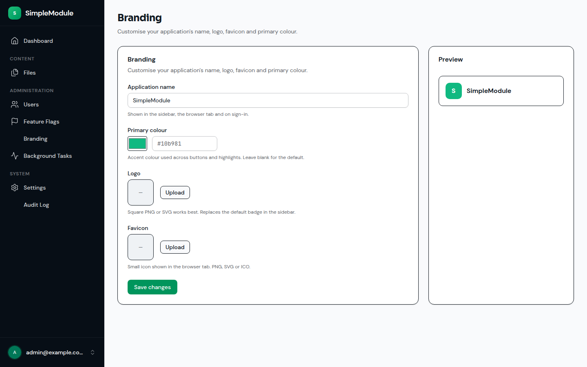
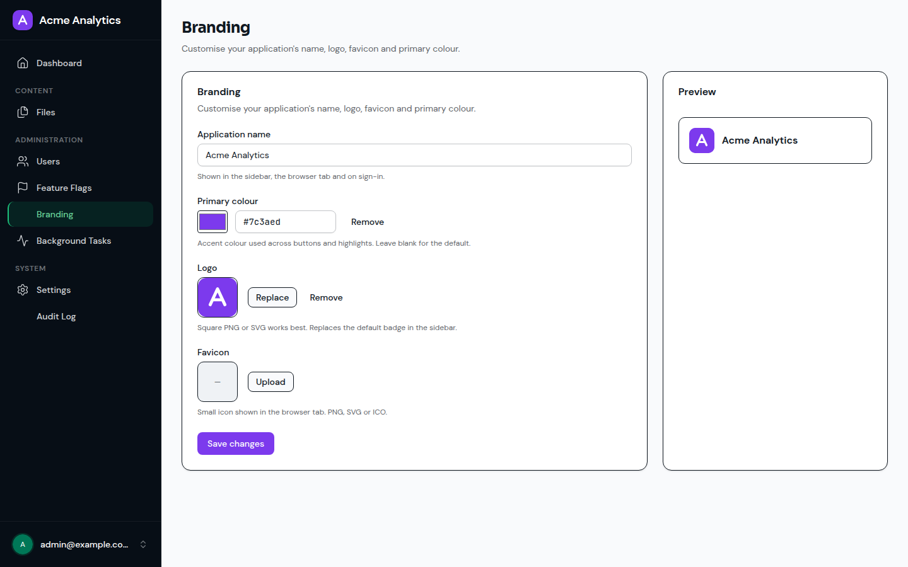
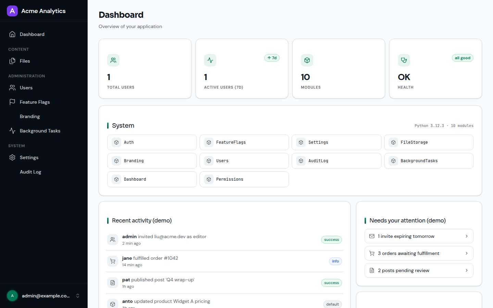

# simple_module_branding

Customisable application branding for [simple_module_python](https://github.com/antosubash/simple_module_python) apps.

An administrator can set the **application name**, **logo**, **favicon** and
**primary brand colour** from the admin UI (`/branding`), and those values are
applied everywhere the framework would otherwise show the default identity —
the sidebar/header logo and name, the browser tab title, the favicon, and the
primary accent colour.

## Screenshots

The admin page at `/branding`, and the same app rebranded as "Acme Analytics"
(custom logo + name + primary colour) across the sidebar and dashboard:

| Admin page | Branding applied | Across the app |
|---|---|---|
|  |  |  |

## Install

The module ships with the default app. To add it to a custom host, declare it
as a dependency and let entry-point discovery pick it up:

```toml
# host/pyproject.toml
dependencies = ["simple_module_branding"]

[tool.uv.sources]
simple_module_branding = { workspace = true }
```

Then `uv sync --all-packages`. It requires the `Settings` and `FileStorage`
modules to be installed too.

## Usage

1. Sign in as an admin and open **Branding** in the sidebar (or visit
   `/branding`).
2. Set the application name, pick a primary colour, and upload a logo and/or
   favicon. Changes apply immediately across the app.

Programmatically, the current branding is available on every page through the
`branding` Inertia shared prop (`appName`, `primaryColor`, `logoUrl`,
`faviconUrl`).

## How it works

- **Storage.** The four values are persisted via the `settings` module's store
  (SYSTEM scope) — there is no branding database table. They hydrate into
  `app.state.branding.settings` at boot and hot-swap on save.
- **Images.** Logo and favicon uploads are stored through the `file_storage`
  module (referenced by UUID). Branding serves them back from its own
  **anonymous** routes, `GET /api/branding/logo` and `GET /api/branding/favicon`
  — `file_storage`'s download endpoint requires `file-storage.download`, which
  no logged-out visitor has, and the sign-in page is exactly where the logo
  must appear. Only the two ids currently held in branding settings are served,
  so this is not a way to read arbitrary files. Uploading and clearing on those
  same paths stay behind `branding.manage` (the exemption is GET-only).
- **Caching.** The published URL carries `?v=<file id>`; a replaced image is a
  new `file_storage` id, so the URL is content-addressed. Versioned requests
  are served `public, max-age=31536000, immutable`; a request without a usable
  version gets `public, max-age=3600` so it self-corrects, and a 404 is never
  cached.
- **Lifecycle.** Replacing or clearing an image deletes the file it stopped
  referencing, so repeated logo tweaks don't leave orphans in `file_storage`.
  Cleanup is best effort: the setting change has already been persisted, so a
  storage fault is logged rather than failing an otherwise-successful rebrand.
- **Upload validation.** PNG, JPEG, WEBP, GIF and ICO up to 2 MB. The declared
  content-type is caller-controlled, so the first bytes are also checked
  against each format's magic number — a payload renamed `logo.png` is
  rejected. SVG is excluded on purpose: it is an XML document that can carry
  `<script>`, so serving one from the app's origin would be stored XSS.
- **Delivery.** A registered Inertia shared-props provider injects a `branding`
  block into every page's shared props (authenticated *and* guest), which the
  frontend reads for the name, logo, favicon and colour.

## Permissions

- `branding.view` — view the branding admin page.
- `branding.manage` — change branding (name, colour, logo, favicon).

The logo and favicon **GET** routes are anonymous by design (registered through
the `register_public_routes` hook); everything else requires a permission.

## Dependencies

Depends on the `Settings` and `FileStorage` modules.

## Notes

- Branding is currently SYSTEM-scoped (one identity per deployment). The
  settings store already supports tenant/user scope, leaving room for
  per-tenant branding later.
- The primary colour overrides the `--primary` / `--sidebar-primary` CSS
  variables from a single hex; the full OKLCH colour scale is not regenerated.

License: MIT
